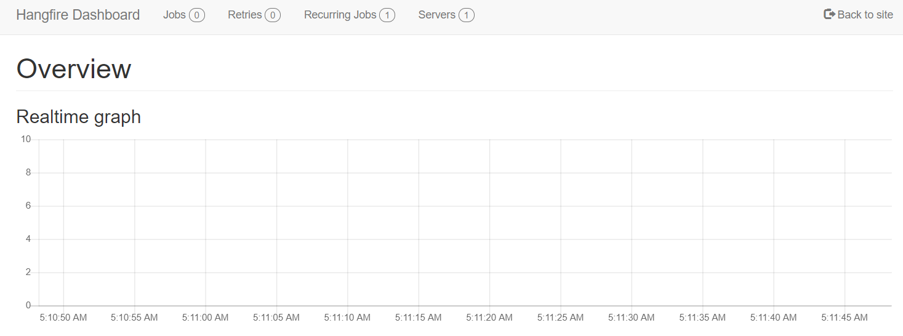

Hangfire Interface
==================
`Hangfire <https://www.hangfire.io/>`_ Interface provides overviews such as current jobs that are running,
job history, recurring jobs, etc.
For now, the hangfire interface can only be accessed within the Task Finder's 
hosted server. 

Link to hangfire: https://eu999k16tsks02.emea.sitel-world.net/taskinvent_core/hangfire

.. warning::

    It is not recommended to change or delete anything within the Hangfire interface.
    If you wish to delete a job, you will have to do it using the Task Finder's interface
    on the **Job** menu.